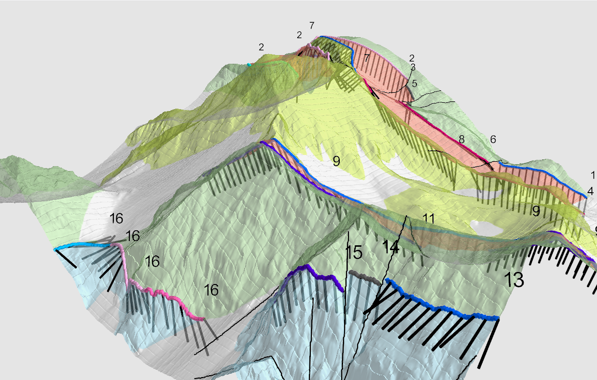

.. TIE documentation master file, created by
   sphinx-quickstart on Sat Dec  2 09:21:46 2023.
   You can adapt this file completely to your liking, but it should at least
   contain the root `toctree` directive.

Welcome to TIE's documentation!
===============================

Python module for "Trace Information Extraction" (TIE) method

In geology, TIE is the process of extracting information related to geological traces or features from data, such as geological maps, satellite imagery, or other sources. TIE involves identifying, isolating, and examining specific trace information to better understand geological formations, processes, or phenomena.

This Python code was ported from MatLab (https://github.com/geoloar/TIE-toolbox), which is part of Anna Rauch's Ph.D Thesis [RAUCH2020]_. 

.. image:: tie-analysis-reports.png
  :width: 400
  :alt: TIE anaylsis reports

.. toctree::
   Home <self>
   usage
   api

.. [RAUCH2020] RAUCH, Anna. Dealing with Uncertainty and Ambiguity in Geological Maps: with Focus on Bedrock Geology. 2020. `Archive ouverte (UniGE) <https://archive-ouverte.unige.ch/unige:141287>`_

Indices and tables
==================

* :ref:`genindex`
* :ref:`modindex`
* :ref:`search`

